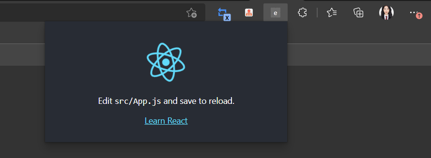

## How to run edge extensions

1. 打包插件   ` yarn run build`
2. 在 edge 浏览器里打开插件中心：edge://extensions，打开开发者模式
3. 点击上传 package，选择文件夹下的 build 文件夹上传
4. 点击插件的图标后，效果如下：



## How to develop an edge extension with react.js

 **manifest.json**

该文件是 edge 插件的配置文件，目的是告诉加载插件的浏览器各个资源文件去哪里取，插件配置信息等等，这个是每个 edge 插件必不可少的组成部分，更多关于 manifest.json 的配置信息：https://developer.chrome.com/docs/extensions/mv3/

```js
{
  "name": "MBTI edge extension",
  "version": "1.0",
  "description": "MBTI edge extension with react.js Demo。",
  "manifest_version": 3,
  "permissions": ["storage","declarativeContent"],
  "content_scripts": [],
  "host_permissions":[],
  "action": {
    "default_popup": "index.html",
    "default_title": "React "
  },
  "icons": {
  }
}
```

 **popup**

独立的弹出页面，就是浏览器右上角一排插件图标点击之后所弹出的页面就是popup
,该页面由相对独立的 html，css 和 js 组成
,这一部分的开发方式也是和传统前端项目最为接近

**content script**

这部分通常是一段JS脚本，目的通常是获取/修改目标页面的DOM，例如你想在目标网页添加一些组件UI都需要借助该脚本实现
.注意该脚本和页面脚本的JS是隔离的，无法直接访问，你没有办法直接拿到目标页面的某些变量来使用（下文会介绍一些其他方法来进行通信）
.但是CSS不是隔离的，所以相同命名的CSS会存在污染的情况，通常需要保证此脚本内部CSS命名的唯一性

**background script**

这一段是运行在浏览器后台的脚本，一般会将需要一直运行的代码放在这里
,他的API权限很高，能访问很多chromeAPI，同时不受跨域限制
